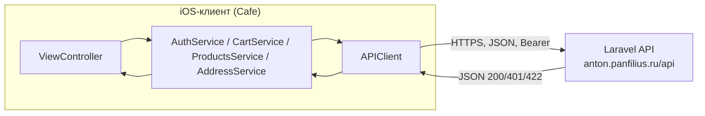
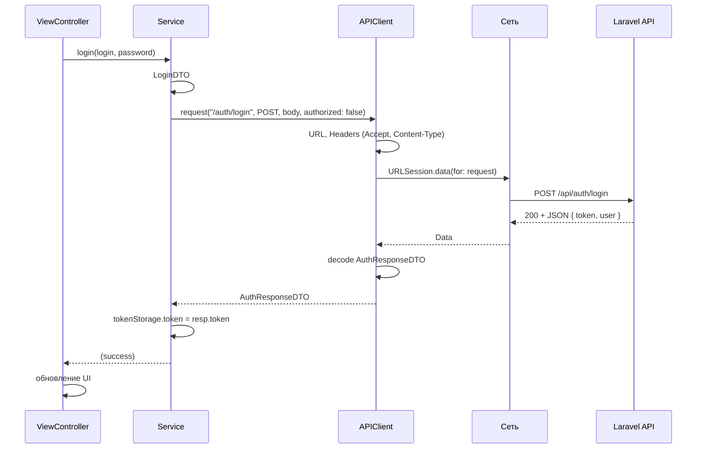

# Схема проекта Cafe: поток данных от клиента к серверу

## 0. Диаграмма потока данных (Mermaid)





## 1. Общая архитектура

```
┌─────────────────────────────────────────────────────────────────────────────┐
│                           iOS‑клиент (Cafe)                                  │
├─────────────────────────────────────────────────────────────────────────────┤
│  Presentation (UI)                                                           │
│  ├── Auth (Login, Register, Forgot)                                          │
│  ├── Menu (LaravelMenuViewController, ProductDetail)                         │
│  ├── Cart (CartViewController)                                               │
│  ├── Profile (ProfileViewController, Addresses, AddAddress)                  │
│  └── Map (MapViewController)                                                 │
│         │                                                                     │
│         ▼                                                                     │
│  Services (бизнес-логика, вызовы API)                                        │
│  ├── AuthService      → /auth/login, /auth/register, /me, /me/update         │
│  ├── ProductsService  → /products, /product/{id}, /products/search            │
│  ├── CartService      → /cart, /cart/items                                   │
│  ├── AddressService   → /addresses                                           │
│  └── ProductDetailService → /product/{id}                                    │
│         │                                                                     │
│         ▼                                                                     │
│  APIClient (один слой для всех HTTP‑запросов)                                │
│  ├── baseURL: https://anton.panfilius.ru/api                                 │
│  ├── TokenStorage (Keychain) ← после логина: Bearer token                     │
│  ├── request(path, method, body?, authorized?)                               │
│  └── Обработка: 200/401/422, JSON decode (DataWrapper / APIResponse / T)     │
└─────────────────────────────────────────────────────────────────────────────┘
                                    │
                                    │ HTTPS, JSON, Bearer (если authorized)
                                    ▼
┌─────────────────────────────────────────────────────────────────────────────┐
│                     Backend API (Laravel, anton.panfilius.ru)                │
└─────────────────────────────────────────────────────────────────────────────┘
```

## 2. Поток данных: запрос от экрана до сервера

```
[ViewController]
       │ вызывает метод сервиса (например AuthService.login)
       ▼
[AuthService / CartService / ...]
       │ формирует DTO (LoginDTO, CartAddItemDTO, …)
       │ вызывает APIClient.request(path, method, body, authorized)
       ▼
[APIClient]
       │ 1. URL = baseURL + path
       │ 2. Headers: Accept: application/json, [Content-Type, Authorization: Bearer token]
       │ 3. body → JSON (keyEncodingStrategy: snake_case)
       │ 4. URLSession.data(for: request)
       ▼
[Сеть] ─────────────────────────────────────────────────────────────────────►
       │
       │ HTTPS request на https://anton.panfilius.ru/api/...
       │
       ▼
[Laravel API]
       │ обрабатывает запрос, возвращает JSON
       ▼
[Сеть] ◄─────────────────────────────────────────────────────────────────────
       │
       ▼
[APIClient]
       │ проверка statusCode (200, 401, 422, …)
       │ decode: DataWrapper<T> | APIResponse<T> | T
       │ при 401 → APIError.unauthorized, при 422 → APIError.validation(errors)
       ▼
[Service]
       │ возвращает декодированную модель (UserDTO, CartDTO, [Product], …)
       │ при необходимости сохраняет token в Keychain (login/register)
       │ при изменении корзины — NotificationCenter (.cartDidChange)
       ▼
[ViewController]
       │ обновляет UI по полученным данным
```

## 3. Схема по экранам (кто какой API дергает)

| Экран / действие        | Сервис        | Метод API (примерно) |
|-------------------------|---------------|-----------------------|
| Логин                   | AuthService   | POST /auth/login      |
| Регистрация             | AuthService   | POST /auth/register   |
| Профиль (загрузка)      | AuthService   | GET /me               |
| Редактирование профиля  | AuthService   | PUT /me/update        |
| Выход                   | AuthService   | локально tokenStorage.clear() |
| Меню (список)           | ProductsService | GET /products       |
| Меню (поиск)            | ProductsService | GET /products/search?query= |
| Карточка товара         | ProductsService / ProductDetailService | GET /product/{id} |
| Добавить в корзину      | CartService   | POST /cart/items      |
| Изменить кол-во в корзине | CartService | PATCH /cart/items/{id} |
| Удалить из корзины      | CartService   | DELETE /cart/items/{id} |
| Очистить корзину       | CartService   | DELETE /cart          |
| Корзина (загрузка)      | CartService   | GET /cart             |
| Список адресов          | AddressService | GET /addresses       |
| Добавить адрес          | AddressService | POST /addresses      |
| Редактировать адрес     | AddressService | PUT /addresses/{id}  |
| Удалить адрес           | AddressService | DELETE /addresses/{id} |

## 4. Форматы ответов API (как понимает APIClient)

- **Успех (2xx):**
  - `{"data": T}` → разворачивается в `T`
  - `{"success": true, "data": T, "error": ...}` → возвращается `T`
  - Прямой ответ `T` или массив `[T]`
- **Ошибки:**
  - 401 → тело с полем `message` → `APIError.unauthorized(message)`
  - 422 → тело с полем `errors: { "field": ["msg"] }` → `APIError.validation(errors)`
  - Остальные коды → `APIError.badStatus(code, message)`

## 5. Дополнительно: Supabase

В проекте инициализирован **SupabaseService** (Supabase client), но в текущем коде экраны работают только через **APIClient** и Laravel API. То есть основной поток данных: **клиент → APIClient → Laravel API**.
